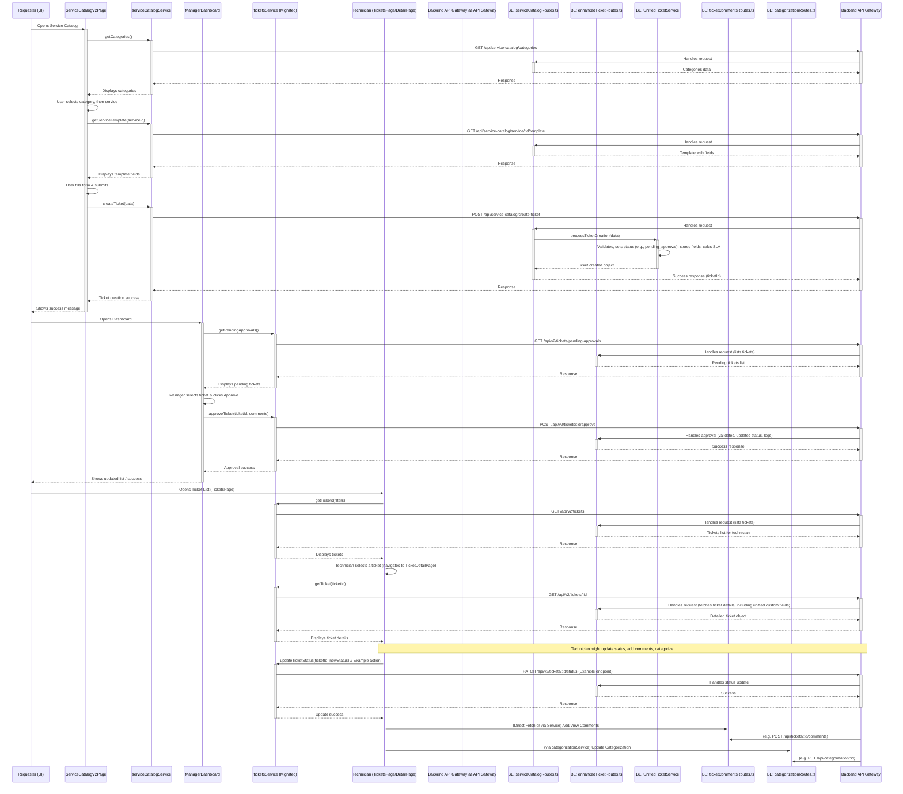

```mermaid
sequenceDiagram
    participant Requester (UI)
    participant ServiceCatalogV2Page
    participant serviceCatalogService
    participant ManagerDashboard
    participant ticketsServiceV2 as ticketsService (Migrated)
    participant TechnicianPages as Technician (TicketsPage/DetailPage)
    participant Backend API Gateway as API Gateway
    participant ServiceCatalogRoutes as BE: serviceCatalogRoutes.ts
    participant EnhancedTicketRoutes as BE: enhancedTicketRoutes.ts
    participant UnifiedTicketService as BE: UnifiedTicketService
    participant TicketCommentsRoutes as BE: ticketCommentsRoutes.ts
    participant CategorizationRoutes as BE: categorizationRoutes.ts

    %% 1. Requester Creates Ticket via Service Catalog V2
    Requester (UI)->>+ServiceCatalogV2Page: Opens Service Catalog
    ServiceCatalogV2Page->>+serviceCatalogService: getCategories()
    serviceCatalogService->>+Backend API Gateway: GET /api/service-catalog/categories
    Backend API Gateway->>+ServiceCatalogRoutes: Handles request
    ServiceCatalogRoutes-->>-Backend API Gateway: Categories data
    Backend API Gateway-->>-serviceCatalogService: Response
    serviceCatalogService-->>-ServiceCatalogV2Page: Displays categories
    ServiceCatalogV2Page->>ServiceCatalogV2Page: User selects category, then service
    ServiceCatalogV2Page->>+serviceCatalogService: getServiceTemplate(serviceId)
    serviceCatalogService->>+Backend API Gateway: GET /api/service-catalog/service/:id/template
    Backend API Gateway->>+ServiceCatalogRoutes: Handles request
    ServiceCatalogRoutes-->>-Backend API Gateway: Template with fields
    Backend API Gateway-->>-serviceCatalogService: Response
    serviceCatalogService-->>-ServiceCatalogV2Page: Displays template fields
    ServiceCatalogV2Page->>ServiceCatalogV2Page: User fills form & submits
    ServiceCatalogV2Page->>+serviceCatalogService: createTicket(data)
    serviceCatalogService->>+Backend API Gateway: POST /api/service-catalog/create-ticket
    Backend API Gateway->>+ServiceCatalogRoutes: Handles request
    ServiceCatalogRoutes->>+UnifiedTicketService: processTicketCreation(data)
    UnifiedTicketService->>UnifiedTicketService: Validates, sets status (e.g., pending_approval), stores fields, calcs SLA
    UnifiedTicketService-->>-ServiceCatalogRoutes: Ticket created object
    ServiceCatalogRoutes-->>-Backend API Gateway: Success response (ticketId)
    Backend API Gateway-->>-serviceCatalogService: Response
    serviceCatalogService-->>-ServiceCatalogV2Page: Ticket creation success
    ServiceCatalogV2Page-->>-Requester (UI): Shows success message

    %% 2. Manager Approves Ticket
    Requester (UI)->>+ManagerDashboard: Opens Dashboard
    ManagerDashboard->>+ticketsServiceV2: getPendingApprovals()
    ticketsServiceV2->>+Backend API Gateway: GET /api/v2/tickets/pending-approvals
    Backend API Gateway->>+EnhancedTicketRoutes: Handles request (lists tickets)
    EnhancedTicketRoutes-->>-Backend API Gateway: Pending tickets list
    Backend API Gateway-->>-ticketsServiceV2: Response
    ticketsServiceV2-->>-ManagerDashboard: Displays pending tickets
    ManagerDashboard->>ManagerDashboard: Manager selects ticket & clicks Approve
    ManagerDashboard->>+ticketsServiceV2: approveTicket(ticketId, comments)
    ticketsServiceV2->>+Backend API Gateway: POST /api/v2/tickets/:id/approve
    Backend API Gateway->>+EnhancedTicketRoutes: Handles approval (validates, updates status, logs)
    EnhancedTicketRoutes-->>-Backend API Gateway: Success response
    Backend API Gateway-->>-ticketsServiceV2: Response
    ticketsServiceV2-->>-ManagerDashboard: Approval success
    ManagerDashboard-->>-Requester (UI): Shows updated list / success

    %% 3. Technician Views and Processes Ticket
    Requester (UI)->>+TechnicianPages: Opens Ticket List (TicketsPage)
    TechnicianPages->>+ticketsServiceV2: getTickets(filters)
    ticketsServiceV2->>+Backend API Gateway: GET /api/v2/tickets
    Backend API Gateway->>+EnhancedTicketRoutes: Handles request (lists tickets)
    EnhancedTicketRoutes-->>-Backend API Gateway: Tickets list for technician
    Backend API Gateway-->>-ticketsServiceV2: Response
    ticketsServiceV2-->>-TechnicianPages: Displays tickets
    TechnicianPages->>TechnicianPages: Technician selects a ticket (navigates to TicketDetailPage)
    TechnicianPages->>+ticketsServiceV2: getTicket(ticketId)
    ticketsServiceV2->>+Backend API Gateway: GET /api/v2/tickets/:id
    Backend API Gateway->>+EnhancedTicketRoutes: Handles request (fetches ticket details, including unified custom fields)
    EnhancedTicketRoutes-->>-Backend API Gateway: Detailed ticket object
    Backend API Gateway-->>-ticketsServiceV2: Response
    ticketsServiceV2-->>-TechnicianPages: Displays ticket details
    Note over TechnicianPages, Backend API Gateway: Technician might update status, add comments, categorize.
    TechnicianPages->>+ticketsServiceV2: updateTicketStatus(ticketId, newStatus) // Example action
    ticketsServiceV2->>+Backend API Gateway: PATCH /api/v2/tickets/:id/status (Example endpoint)
    Backend API Gateway->>+EnhancedTicketRoutes: Handles status update
    EnhancedTicketRoutes-->>-Backend API Gateway: Success
    Backend API Gateway-->>-ticketsServiceV2: Response
    ticketsServiceV2-->>-TechnicianPages: Update success

    TechnicianPages->>+TicketCommentsRoutes: (Direct Fetch or via Service) Add/View Comments
    Backend API Gateway->>TicketCommentsRoutes: (e.g. POST /api/tickets/:id/comments)

    TechnicianPages->>+CategorizationRoutes: (via categorizationService) Update Categorization
    Backend API Gateway->>CategorizationRoutes: (e.g. PUT /api/categorization/:id)
```